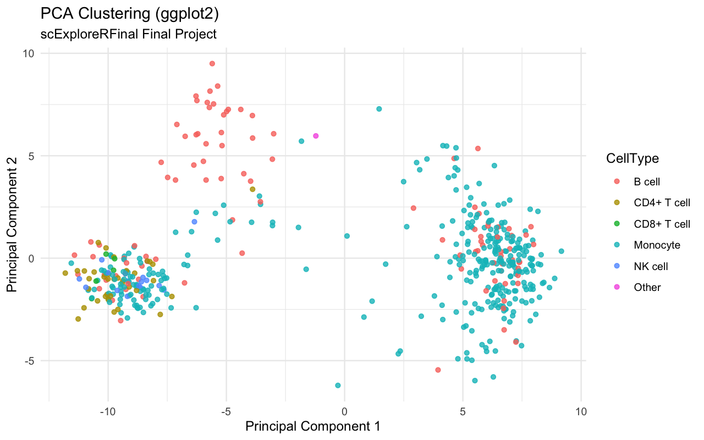
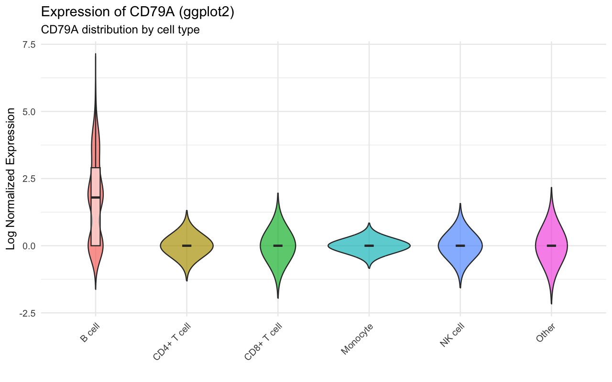

# scExploreRFinal

**scExploreRFinal** is an educational R package for exploring single-cell RNA sequencing (scRNA-seq) data. It is the final-project version of the `scExploreR` package skeleton submitted for Assignment 10, extended with the defensive-programming patterns from Assignment 11 and the long-form documentation patterns from Assignment 12.

## About the Author & Context
I am an undergraduate pre-med student at the **University of South Florida (USF)**. This package was developed for **LIS4370, Advanced R Programming**, taught by Dr. Alon Friedman in the School of Information within the College of Arts and Sciences.

To fulfill research experience requirements for medical school admissions, I am currently working in the Machine Learning Department at **Moffitt Cancer Center** in the **El Naqa Lab**, where I am conducting a case study on clear cell renal cell carcinoma (ccRCC).

*Project Inspiration:* My exposure to complex genomics and spatial transcriptomics during my research experience inspired me to formulate this idea. This R package is an independent educational tool, not an official product of the El Naqa Lab. It was created solely for my Advanced R Programming final project as a programmatic exploration of the foundational statistical routines underlying scRNA-seq analysis.

## Installation

```r
# install.packages("devtools")
devtools::install_github(
  "LeyaAlexander/r-programming-assignments",
  subdir = "scExploreRFinal",
  build_vignettes = TRUE
)
```

## Overview of Features

- **S3 Object-Oriented Framework**: Wraps the sparse expression matrix inside a custom `scData` class with `print`, `summary`, and `plot` methods.
- **Multiple Plotting Systems**: Render identical PCA scatter and gene-expression boxplots using Base Graphics, `lattice`, and `ggplot2`.
- **Integrated Statistical Testing**: Wrappers for descriptive statistics, two-sample t-tests, Wilcoxon rank-sum, and one-way ANOVA over cell-type groups.
- **Defensive Input Validation**: Every public function checks class, type, and group membership before running, returning informative error messages instead of cryptic stack traces.
- **Authentic Dataset**: Lazily loads a subset (500 cells, 100 genes) curated from the **"3k PBMCs from a Healthy Donor"** public dataset.
  - *Data Citation:* 10x Genomics. (2016). *3k PBMCs from a Healthy Donor* \[Data set\]. Single Cell Gene Expression Dataset. Available at the [10x Genomics support site](https://support.10xgenomics.com/single-cell-gene-expression/datasets/1.1.0/pbmc3k).

## Usage Overview

```r
library(scExploreRFinal)

# 1. Load the S3 object
d <- load_scrna()
print(d)
summary(d)

# 2. Visualize cell clusters via PCA in your preferred plotting system
plot(d, method = "ggplot2")
plot_expression(d, gene = "CD79A", method = "ggplot2")

# 3. Run statistical checks
explore_genes(d, "CD79A")
compare_expression(d, "CD8A", "CD8+ T cell", "B cell", method = "t.test")
compare_expression(d, "CD8A", "CD8+ T cell", "B cell", method = "wilcox")
summary(run_anova(d, "CD8A"))
```

## What You Should See

- `print(d)` reports an `scData` object with 500 cells and 100 genes.
- `summary(d)` prints cell-type counts (with Monocyte as the largest group) and library-size min/mean/max.
- `plot_pca()` shows clustered cells in PC1/PC2 space by cell type.
- `plot_expression(..., gene = "CD79A")` shows CD79A concentrated in B cells.
- `compare_expression(..., method = "t.test")` and `compare_expression(..., method = "wilcox")` both return significant p-values for CD8A between CD8+ T cells and B cells.
- `summary(run_anova(...))` returns a significant global test across cell types for CD8A.

If your output matches the patterns above, the package is running correctly.

## Sample Output

Example console output from `print(d)`:

```text
scExploreRFinal Single-Cell Data Object
----------------------------------
Cells (N): 500
Genes (Variables): 100
Cell Types Available: B cell, CD4+ T cell, CD8+ T cell, Monocyte, NK cell, Other
```

Example statistical result for `summary(run_anova(d, "CD8A"))`:

```text
             Df Sum Sq Mean Sq F value   Pr(>F)
CellType      5  28.68   5.736   16.17 8.86e-15 ***
Residuals   494 175.24   0.355
```

## Sample Figures

PCA clustering across cell types:



CD79A expression across cell types:



For the full narrative walkthrough, see the vignette source: [vignettes/scExploreRFinal_overview.Rmd](vignettes/scExploreRFinal_overview.Rmd).

## Defensive Validation Examples

Public functions are defensive by design and return clear errors for invalid inputs:

```r
tryCatch(explore_genes(d, 123), error = function(e) message(e$message))
tryCatch(explore_genes(d, "FAKE"), error = function(e) message(e$message))
tryCatch(compare_expression(d, "CD8A", "CD8+ T cell", "FAKE"), error = function(e) message(e$message))
```

Expected messages include:
- `gene must be a single character string.`
- `Gene FAKE not found in dataset.`
- `Cell type not found.`

## License

CC0 1.0 Universal (Public Domain Dedication).

## AI Usage Statement

Generative AI was used as a programming assistant during development. Specifically, GitHub Copilot (GPT-5.3-Codex) helped with package scaffolding, roxygen2 header structure, S3 method bindings, defensive-programming refactors, and DESCRIPTION metadata review. All package design choices, statistical logic, plotting-system comparisons, and the choice of which 10x Genomics dataset to bundle were made by the student author and verified against course materials. AI-generated code was reviewed and tested before commit.

## AI-Assisted Statistical Interpretation (Local Run Snapshot)

The following interpretation summary was generated with AI assistance from a local run of package functions.

- Dataset summary: 500 cells, 100 genes, 6 cell-type labels. Monocytes are the largest group (340/500), indicating class imbalance that should be kept in mind when interpreting global tests.
- Marker pattern check (`explore_genes("CD79A")`): mean expression is elevated in B cells (mean 1.73) and near zero in other listed groups, consistent with CD79A as a B-cell-associated marker in this subset.
- Two-group differential test (`compare_expression("CD8A", "CD8+ T cell", "B cell")`):
  - Welch t-test: p = 0.0003915, estimated mean difference indicates CD8A is higher in CD8+ T cells than in B cells.
  - Wilcoxon rank-sum: p = 4.841e-07, supporting the same direction under a non-parametric assumption.
- Multi-group test (`run_anova("CD8A")`): F(5, 494) = 16.17, p = 8.86e-15, suggesting at least one cell type differs in mean CD8A expression.
- Consistency across tests: t-test, Wilcoxon, and ANOVA all agree on strong differential signal for CD8A in this dataset, increasing confidence in the biological interpretation.

These interpretations are based on local runs of the same commands shown in the Usage Overview section.
